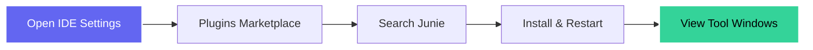
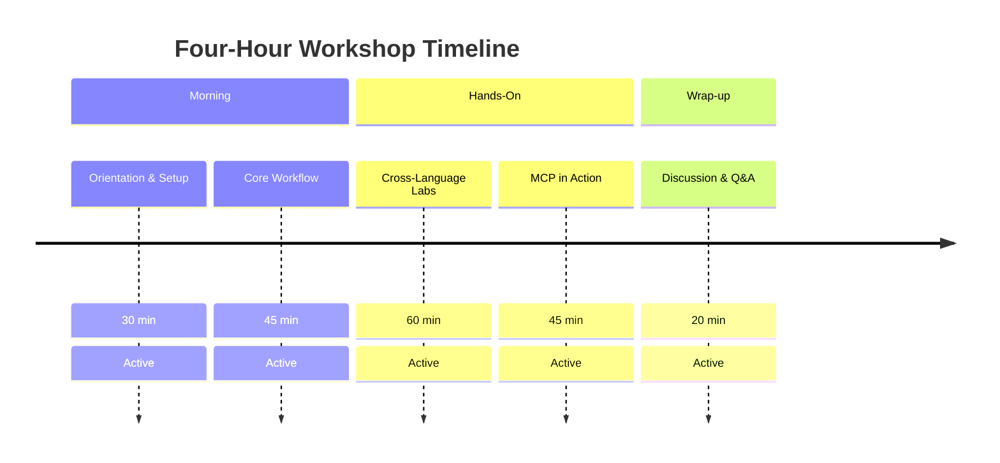
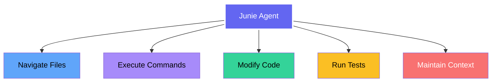
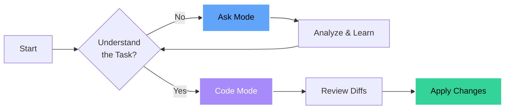
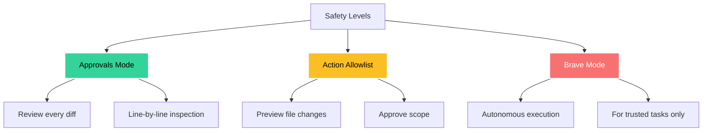
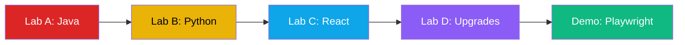
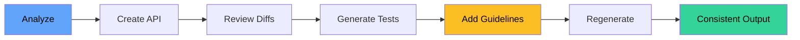
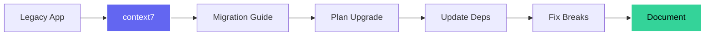
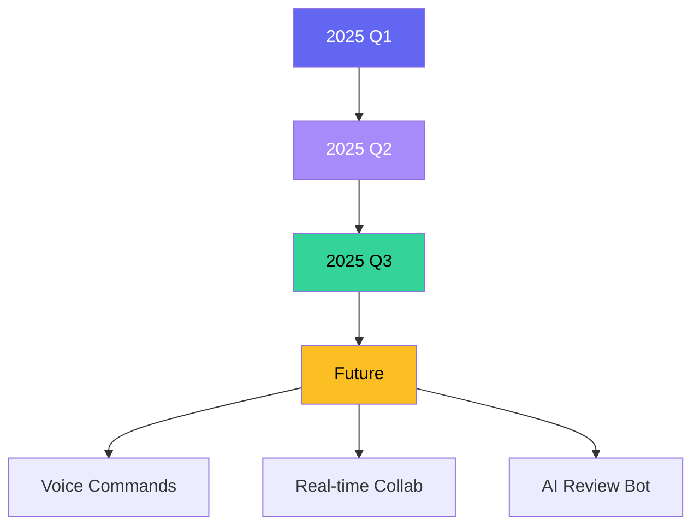
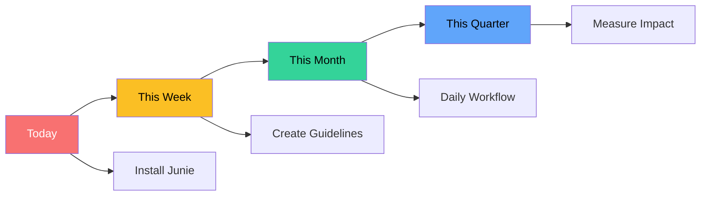

# Junie: Your AI Coding Agent in JetBrains IDEs
## <span style="color: #fbbf24; font-size: 1.3em;">Autonomous Coding with Safety Controls</span>

<div style="color: #e0f2fe; font-size: 1.1em; margin-top: 1.5em;">
Transform Your Development Workflow<br/>
with AI-Powered Automation
</div>

<div style="color: #c4b5fd; font-size: 0.9em; margin-top: 2em;">
Four-Hour Hands-On Workshop
</div>

---
layout: default
background: 'linear-gradient(to bottom right, #1e293b, #334155)'
---

## <span style="color: #60a5fa;">🎯 What You'll Master Today</span>

<div style="display: grid; grid-template-columns: 1fr 1fr; gap: 1.5rem; font-size: 1.1em;">

<div style="background: rgba(96,165,250,0.15); padding: 1em; border-radius: 8px; border-left: 4px solid #60a5fa;">

### <span style="color: #60a5fa;">Core Concepts</span>
<div style="color: #dbeafe;">
• 🔍 <strong>Ask Mode</strong>: Analysis & insights<br/>
• ⚡ <strong>Code Mode</strong>: Automated changes<br/>
• 📋 <strong>Guidelines</strong>: Team conventions<br/>
• 🛡️ <strong>Safety</strong>: Approvals & controls
</div>

</div>

<div style="background: rgba(168,85,247,0.15); padding: 1em; border-radius: 8px; border-left: 4px solid #a78bfa;">

### <span style="color: #a78bfa;">Hands-On Labs</span>
<div style="color: #e9d5ff;">
• ☕ <strong>Java</strong>: Spring Boot APIs<br/>
• 🐍 <strong>Python</strong>: Refactoring & testing<br/>
• ⚛️ <strong>React</strong>: Forms & validation<br/>
• 🔧 <strong>MCP</strong>: External tool integration
</div>

</div>

</div>

---
background: 'linear-gradient(135deg, #065f46, #047857)'
---

## <span style="color: #86efac;">📚 Prerequisites Check</span>

<div style="font-size: 1.2em; line-height: 2; color: #d1fae5;">

✅ **JetBrains IDE** (IntelliJ IDEA, PyCharm, or WebStorm)

✅ **JetBrains AI Pro** subscription

✅ **Development Environment** (Java 17+ / Python 3.8+ / Node 16+)

<div style="margin-top: 1.5em; padding: 1em; background: rgba(251,191,36,0.15); border-radius: 8px; border: 2px solid #fbbf24;">
<span style="color: #fbbf24;">💡 Quick Setup:</span> <span style="color: #fef3c7;">We'll install Junie together in the first 5 minutes</span>
</div>

</div>

---
background: 'linear-gradient(135deg, #1e40af, #1e3a8a)'
---

## <span style="color: #fbbf24;">🚀 Installation in 60 Seconds</span>



<div style="margin-top: 2em; font-size: 1.1em;">

**Available Models:**
<div style="display: flex; gap: 1rem; margin-top: 0.5em;">
<span style="background: rgba(251,191,36,0.2); padding: 0.5em 1em; border-radius: 5px; color: #fef3c7;">🎯 GPT-5 (default)</span>
<span style="background: rgba(167,139,250,0.2); padding: 0.5em 1em; border-radius: 5px; color: #e9d5ff;">🧠 Claude Sonnet 3.7</span>
<span style="background: rgba(52,211,153,0.2); padding: 0.5em 1em; border-radius: 5px; color: #d1fae5;">⚡ Claude Sonnet 4.0</span>
</div>

</div>

---
background: 'linear-gradient(135deg, #dc2626, #991b1b)'
---

## <span style="color: #fbbf24;">📅 Today's Journey</span>



<div style="margin-top: 1em; text-align: center; color: #fecaca;">
☕ Break after Core Workflow segment
</div>

---
background: 'linear-gradient(135deg, #7c3aed, #6d28d9)'
---

## <span style="color: #fbbf24;">🤖 What is Junie?</span>

<div style="text-align: center; margin: 1em 0; color: #e9d5ff;">

**JetBrains' AI-Powered Coding Agent**

</div>



---
background: 'linear-gradient(135deg, #312e81, #4c1d95)'
---

## <span style="color: #fbbf24;">🔄 Two Operating Modes</span>

<div style="display: grid; grid-template-columns: 1fr 1fr; gap: 2rem; margin-top: 2em;">

<div style="background: linear-gradient(135deg, rgba(96,165,250,0.15), rgba(96,165,250,0.1)); padding: 1.5em; border-radius: 12px; border: 2px solid #60a5fa;">

### <span style="color: #60a5fa;">🔍 Ask Mode</span>

<div style="color: #dbeafe;">
<strong>Read-Only Analysis</strong>

• Explain complex code<br/>
• Analyze architecture<br/>
• Find bugs & issues<br/>
• Review security<br/>
• Check test coverage

<div style="margin-top: 1em; color: #93c5fd; font-size: 0.9em;">
Perfect for understanding before changing
</div>
</div>

</div>

<div style="background: linear-gradient(135deg, rgba(168,85,247,0.15), rgba(168,85,247,0.1)); padding: 1.5em; border-radius: 12px; border: 2px solid #a78bfa;">

### <span style="color: #a78bfa;">⚡ Code Mode</span>

<div style="color: #e9d5ff;">
<strong>Make Changes</strong>

• Implement features<br/>
• Fix bugs<br/>
• Refactor code<br/>
• Generate tests<br/>
• Update dependencies

<div style="margin-top: 1em; color: #c4b5fd; font-size: 0.9em;">
Executes multi-step plans with diffs
</div>
</div>

</div>

</div>

---
background: 'linear-gradient(135deg, #065f46, #047857)'
---

## <span style="color: #fbbf24;">💡 Pro Workflow</span>



<div style="text-align: center; margin-top: 2em; font-size: 1.3em; color: #86efac;">
✨ Always start with Ask mode for complex tasks
</div>

---
background: 'linear-gradient(135deg, #1e40af, #1e3a8a)'
---

## <span style="color: #fbbf24;">📝 Project Guidelines</span>

<div style="font-size: 1.1em; color: #e0f2fe;">

**Location:** `.junie/guidelines.md`

```markdown
## Technology Stack
- Framework: Spring Boot 3.2
- Testing: JUnit 5 + AssertJ

## Conventions
- REST: /api/v1/{resource}
- DTOs: Java records
- Tests: Given-When-Then
```

<div style="display: grid; grid-template-columns: 1fr 1fr; gap: 1rem; margin-top: 1.5em;">

<div style="background: rgba(239,68,68,0.15); padding: 0.8em; border-radius: 8px; border: 1px solid #ef4444;">
<strong style="color: #fca5a5;">❌ Without Guidelines</strong><br/>
<span style="color: #fecaca;">
Inconsistent patterns<br/>
Multiple review cycles<br/>
Style conflicts
</span>
</div>

<div style="background: rgba(52,211,153,0.15); padding: 0.8em; border-radius: 8px; border: 1px solid #10b981;">
<strong style="color: #86efac;">✅ With Guidelines</strong><br/>
<span style="color: #a7f3d0;">
Consistent output<br/>
70% fewer reviews<br/>
Team alignment
</span>
</div>

</div>

</div>

---
background: 'linear-gradient(135deg, #dc2626, #991b1b)'
---

## <span style="color: #fbbf24;">🛡️ Safety Controls</span>



---
background: 'linear-gradient(135deg, #065f46, #047857)'
---

## <span style="color: #fbbf24;">⚡ When to Use Each Mode</span>

<style>
.mode-table { width: 100%; border-collapse: collapse; margin-top: 1em; }
.mode-table th, .mode-table td { padding: 0.8em; text-align: left; border: 1px solid rgba(251,191,36,0.3); color: #e0f2fe; }
.mode-table th { background: rgba(251,191,36,0.2); color: #fbbf24; }
.good { color: #86efac; }
.caution { color: #fbbf24; }
.danger { color: #f87171; }
</style>

<table class="mode-table">
<thead>
<tr>
<th>Mode</th>
<th>Good For</th>
<th>Not For</th>
</tr>
</thead>
<tbody>
<tr>
<td><strong class="good">Approvals</strong></td>
<td>• Critical business logic<br/>• First-time tasks<br/>• Learning Junie</td>
<td>• Repetitive formatting<br/>• Simple refactors</td>
</tr>
<tr>
<td><strong class="caution">Allowlist</strong></td>
<td>• Known file sets<br/>• Defined scope<br/>• Team reviews</td>
<td>• Exploratory changes<br/>• Unknown impact</td>
</tr>
<tr>
<td><strong class="danger">Brave</strong></td>
<td>• Test generation<br/>• Formatting<br/>• Documentation</td>
<td>• Production code<br/>• Database changes<br/>• First attempts</td>
</tr>
</tbody>
</table>

---
background: 'linear-gradient(135deg, #7c3aed, #6d28d9)'
---

## <span style="color: #fbbf24;">🔌 MCP: Model Context Protocol</span>

<div style="display: grid; grid-template-columns: 1fr 1fr; gap: 2rem; margin-top: 1em;">

<div>

### Available Tools

<div style="background: rgba(96,165,250,0.15); padding: 1em; border-radius: 8px; margin: 0.5em 0; border: 1px solid #3b82f6;">
<strong style="color: #60a5fa;">📚 context7</strong><br/>
<span style="color: #dbeafe;">
• Real-time library docs<br/>
• 1000+ libraries<br/>
• Version compatibility<br/>
• No API key needed!
</span>
</div>

<div style="background: rgba(168,85,247,0.15); padding: 1em; border-radius: 8px; border: 1px solid #8b5cf6;">
<strong style="color: #a78bfa;">🎭 Playwright</strong><br/>
<span style="color: #e9d5ff;">
• E2E test generation<br/>
• Browser automation<br/>
• Accessibility-first<br/>
• TypeScript output
</span>
</div>

</div>

<div>

### Configuration

```json
{
  "mcpServers": {
    "context7": { 
      "command": "npx", 
      "args": ["@upstash/context7"] 
    },
    "playwright": {
      "command": "npx",
      "args": ["@playwright/mcp-server"]
    }
  }
}
```

<div style="margin-top: 1em; color: #e9d5ff; font-size: 0.9em;">
Settings → Junie → MCP → Edit mcp.json
</div>

</div>

</div>

---
background: 'linear-gradient(135deg, #1e40af, #1e3a8a)'
---

## <span style="color: #fbbf24;">🧪 Lab Overview</span>

<div style="display: grid; grid-template-columns: 2fr 1fr; gap: 2rem;">

<div>



</div>

<div style="font-size: 0.9em; color: #e0f2fe;">

**Timing:**
- Lab A: 45-60 min
- Lab B: 30-45 min
- Lab C: 30-45 min
- Lab D: 20-30 min
- Demo: 20-30 min

</div>

</div>

<div style="display: grid; grid-template-columns: repeat(4, 1fr); gap: 1rem; margin-top: 2em;">

<div style="background: rgba(220,38,38,0.15); padding: 1em; border-radius: 8px; text-align: center; border: 1px solid #dc2626;">
<strong style="color: #fca5a5;">☕ Java</strong><br/>
<span style="color: #fecaca;">
Spring Boot<br/>
REST APIs<br/>
JUnit + AssertJ
</span>
</div>

<div style="background: rgba(234,179,8,0.15); padding: 1em; border-radius: 8px; text-align: center; border: 1px solid #eab308;">
<strong style="color: #fde047;">🐍 Python</strong><br/>
<span style="color: #fef3c7;">
PEP 8<br/>
Type hints<br/>
pytest
</span>
</div>

<div style="background: rgba(14,165,233,0.15); padding: 1em; border-radius: 8px; text-align: center; border: 1px solid #0ea5e9;">
<strong style="color: #7dd3fc;">⚛️ React</strong><br/>
<span style="color: #bae6fd;">
TypeScript<br/>
Forms<br/>
Testing Library
</span>
</div>

<div style="background: rgba(139,92,246,0.15); padding: 1em; border-radius: 8px; text-align: center; border: 1px solid #8b5cf6;">
<strong style="color: #c4b5fd;">🔧 MCP</strong><br/>
<span style="color: #e9d5ff;">
context7<br/>
Upgrades<br/>
Migration
</span>
</div>

</div>

---
background: 'linear-gradient(135deg, #dc2626, #991b1b)'
---

## <span style="color: #fbbf24;">☕ Lab A: Spring Boot Journey</span>



<div style="display: grid; grid-template-columns: 1fr 1fr; gap: 1rem; margin-top: 1em;">

<div style="background: rgba(239,68,68,0.15); padding: 0.8em; border-radius: 8px; border: 1px solid #dc2626;">
<strong style="color: #fca5a5;">Without Guidelines</strong><br/>
<span style="color: #fecaca; font-size: 0.9em;">
• Inconsistent patterns<br/>
• Various styles<br/>
• More review cycles
</span>
</div>

<div style="background: rgba(52,211,153,0.15); padding: 0.8em; border-radius: 8px; border: 1px solid #10b981;">
<strong style="color: #86efac;">With Guidelines</strong><br/>
<span style="color: #a7f3d0; font-size: 0.9em;">
• Consistent code<br/>
• Team standards<br/>
• Faster approval
</span>
</div>

</div>

---
background: 'linear-gradient(135deg, #eab308, #a16207)'
---

## <span style="color: #fef3c7;">🐍 Lab B: Python Transformation</span>

<div style="display: grid; grid-template-columns: 1fr 1fr; gap: 2rem;">

<div style="background: rgba(220,38,38,0.15); padding: 1em; border-radius: 8px; border: 1px solid #dc2626;">

### <span style="color: #fca5a5;">Before 😱</span>
```python
def calc(x,y,op):
    if op=="add": return x+y
    elif op=="sub": return x-y
```
<span style="color: #fecaca;">
• No type hints<br/>
• Poor naming<br/>
• No tests<br/>
• No docs
</span>

</div>

<div style="background: rgba(52,211,153,0.15); padding: 1em; border-radius: 8px; border: 1px solid #10b981;">

### <span style="color: #86efac;">After ✨</span>
```python
def calculate(
    x: float, 
    y: float, 
    operation: str
) -> Optional[float]:
    """Calculate result.
    
    Args:
        x: First number
        y: Second number
        operation: Operation
        
    Returns:
        Calculation result
    """
```

</div>

</div>

---
background: 'linear-gradient(135deg, #0ea5e9, #0369a1)'
---

## <span style="color: #fbbf24;">⚛️ Lab C: React Forms</span>

<div style="color: #e0f2fe;">

```typescript
interface RegistrationForm {
  email: string;      // valid email
  password: string;   // min 8, special char
  confirm: string;    // must match
  terms: boolean;     // required
}
```

</div>

<div style="display: grid; grid-template-columns: repeat(4, 1fr); gap: 1rem; margin-top: 2em;">

<div style="background: rgba(96,165,250,0.2); padding: 0.8em; border-radius: 8px; text-align: center; border: 1px solid #3b82f6;">
<strong style="color: #93c5fd;">React Hook Form</strong><br/>
<span style="color: #dbeafe;">Form state</span>
</div>

<div style="background: rgba(168,85,247,0.2); padding: 0.8em; border-radius: 8px; text-align: center; border: 1px solid #8b5cf6;">
<strong style="color: #c4b5fd;">Zod</strong><br/>
<span style="color: #e9d5ff;">Validation</span>
</div>

<div style="background: rgba(52,211,153,0.2); padding: 0.8em; border-radius: 8px; text-align: center; border: 1px solid #10b981;">
<strong style="color: #86efac;">Testing Library</strong><br/>
<span style="color: #a7f3d0;">90% coverage</span>
</div>

<div style="background: rgba(251,191,36,0.2); padding: 0.8em; border-radius: 8px; text-align: center; border: 1px solid #f59e0b;">
<strong style="color: #fde047;">Accessibility</strong><br/>
<span style="color: #fef3c7;">ARIA compliant</span>
</div>

</div>

---
background: 'linear-gradient(135deg, #8b5cf6, #6d28d9)'
---

## <span style="color: #fbbf24;">🔧 Lab D: Smart Upgrades with context7</span>



<div style="display: flex; justify-content: center; gap: 2rem; margin-top: 1.5em;">

<div style="text-align: center;">
<span style="color: #fca5a5; font-size: 1.5em;">React 17</span><br/>
<span style="color: #fecaca;">Legacy</span>
</div>

<div style="font-size: 2em; color: #fbbf24;">→</div>

<div style="text-align: center;">
<span style="color: #86efac; font-size: 1.5em;">React 18</span><br/>
<span style="color: #a7f3d0;">Modern</span>
</div>

</div>

---
background: 'linear-gradient(135deg, #10b981, #047857)'
---

## <span style="color: #fbbf24;">🎭 Demo: Playwright Magic</span>

<div style="text-align: center; font-size: 1.2em; margin: 1em 0; color: #d1fae5;">

**Generate E2E Tests in 5 Minutes**

</div>

```typescript
test('successful login', async ({ page }) => {
  const loginPage = new LoginPage(page);
  await loginPage.goto();
  await loginPage.login('user@example.com', 'pass');
  
  await expect(page).toHaveURL('/dashboard');
  await expect(page.getByRole('heading', { name: 'Welcome' }))
    .toBeVisible();
});
```

<div style="display: grid; grid-template-columns: repeat(4, 1fr); gap: 1rem; margin-top: 2em;">

<div style="background: rgba(251,191,36,0.2); padding: 0.5em; border-radius: 5px; text-align: center; border: 1px solid #f59e0b;">
<span style="color: #fef3c7;">✅ Page Objects</span>
</div>

<div style="background: rgba(96,165,250,0.2); padding: 0.5em; border-radius: 5px; text-align: center; border: 1px solid #3b82f6;">
<span style="color: #dbeafe;">✅ Accessibility</span>
</div>

<div style="background: rgba(168,85,247,0.2); padding: 0.5em; border-radius: 5px; text-align: center; border: 1px solid #8b5cf6;">
<span style="color: #e9d5ff;">✅ TypeScript</span>
</div>

<div style="background: rgba(52,211,153,0.2); padding: 0.5em; border-radius: 5px; text-align: center; border: 1px solid #10b981;">
<span style="color: #a7f3d0;">✅ Retry Logic</span>
</div>

</div>

---
background: 'linear-gradient(135deg, #1e40af, #1e3a8a)'
---

## <span style="color: #fbbf24;">⚔️ Junie vs The Competition</span>

<style>
.compare-table { width: 100%; border-collapse: collapse; }
.compare-table th { background: rgba(99,102,241,0.2); color: #fbbf24; padding: 0.8em; }
.compare-table td { padding: 0.6em; text-align: center; border: 1px solid rgba(99,102,241,0.3); color: #e0f2fe; }
.yes { color: #86efac; font-weight: bold; }
.no { color: #f87171; }
.partial { color: #fbbf24; }
</style>

<table class="compare-table">
<thead>
<tr>
<th>Feature</th>
<th>Junie</th>
<th>Copilot</th>
<th>Cursor</th>
<th>Codeium</th>
</tr>
</thead>
<tbody>
<tr>
<td style="text-align: left;">Multi-file edits</td>
<td class="yes">✅ Full</td>
<td class="no">❌</td>
<td class="yes">✅</td>
<td class="partial">⚠️</td>
</tr>
<tr>
<td style="text-align: left;">Test execution</td>
<td class="yes">✅ Yes</td>
<td class="no">❌</td>
<td class="no">❌</td>
<td class="no">❌</td>
</tr>
<tr>
<td style="text-align: left;">Rollback</td>
<td class="yes">✅ Yes</td>
<td class="no">❌</td>
<td class="partial">⚠️</td>
<td class="no">❌</td>
</tr>
<tr>
<td style="text-align: left;">MCP tools</td>
<td class="yes">✅ Yes</td>
<td class="no">❌</td>
<td class="no">❌</td>
<td class="no">❌</td>
</tr>
<tr>
<td style="text-align: left;">IDE native</td>
<td class="yes">✅ Full</td>
<td class="partial">⚠️</td>
<td class="no">❌</td>
<td class="partial">⚠️</td>
</tr>
</tbody>
</table>

---
background: 'linear-gradient(135deg, #065f46, #047857)'
---

## <span style="color: #fbbf24;">🎯 Common Patterns</span>

<div style="display: grid; grid-template-columns: 1fr 1fr 1fr; gap: 1.5rem;">

<div style="background: rgba(96,165,250,0.15); padding: 1em; border-radius: 8px; border: 1px solid #3b82f6;">

### <span style="color: #93c5fd;">TDD Flow</span>
<span style="color: #dbeafe;">
1. Ask: "What tests?"<br/>
2. Code: "Generate tests"<br/>
3. Code: "Implement"
</span>

<div style="color: #60a5fa; margin-top: 0.5em;">
Red → Green → Refactor
</div>

</div>

<div style="background: rgba(168,85,247,0.15); padding: 1em; border-radius: 8px; border: 1px solid #8b5cf6;">

### <span style="color: #c4b5fd;">Safe Refactoring</span>
<span style="color: #e9d5ff;">
1. Generate tests<br/>
2. Identify issues<br/>
3. Refactor safely
</span>

<div style="color: #a78bfa; margin-top: 0.5em;">
Tests stay green
</div>

</div>

<div style="background: rgba(52,211,153,0.15); padding: 1em; border-radius: 8px; border: 1px solid #10b981;">

### <span style="color: #86efac;">Upgrades</span>
<span style="color: #a7f3d0;">
1. context7 check<br/>
2. Update deps<br/>
3. Fix breaks
</span>

<div style="color: #34d399; margin-top: 0.5em;">
Systematic migration
</div>

</div>

</div>

---
background: 'linear-gradient(135deg, #dc2626, #991b1b)'
---

## <span style="color: #fbbf24;">🚀 CI/CD Integration</span>

```yaml
name: Junie Guidelines Check
on: [pull_request]

jobs:
  guidelines-compliance:
    runs-on: ubuntu-latest
    steps:
      - uses: actions/checkout@v3
      - name: Check guidelines
        run: |
          # Validate against .junie/guidelines.md
          # Ensure consistency
```

<div style="display: flex; justify-content: center; gap: 2rem; margin-top: 2em;">

<div style="background: rgba(251,191,36,0.15); padding: 1em; border-radius: 8px; border: 1px solid #f59e0b;">
<strong style="color: #fde047;">Pre-commit</strong><br/>
<span style="color: #fef3c7;">Local validation</span>
</div>

<div style="background: rgba(96,165,250,0.15); padding: 1em; border-radius: 8px; border: 1px solid #3b82f6;">
<strong style="color: #93c5fd;">CI Pipeline</strong><br/>
<span style="color: #dbeafe;">Automated checks</span>
</div>

<div style="background: rgba(52,211,153,0.15); padding: 1em; border-radius: 8px; border: 1px solid #10b981;">
<strong style="color: #86efac;">PR Review</strong><br/>
<span style="color: #a7f3d0;">Team alignment</span>
</div>

</div>

---
background: 'linear-gradient(135deg, #7c3aed, #6d28d9)'
---

## <span style="color: #fbbf24;">📈 Future Roadmap</span>

<div style="display: grid; grid-template-columns: 1fr 1fr; gap: 2rem; color: #e9d5ff;">

<div>

### <span style="color: #c4b5fd;">Q1 2025</span>
• 🎯 GPT-5 as default<br/>
• 🔄 Multi-repo support<br/>
• 💻 VS Code beta

### <span style="color: #c4b5fd;">Q2 2025</span>
• 🐙 GitHub PR reviews<br/>
• 🛍️ MCP marketplace<br/>
• 👥 Team guidelines

</div>

<div>



</div>

</div>

---
background: 'linear-gradient(135deg, #065f46, #047857)'
---

## <span style="color: #fbbf24;">✨ Key Takeaways</span>

<div style="font-size: 1.3em; line-height: 2; margin-top: 1em; color: #d1fae5;">

✅ **Ask before Code** - Understand first, implement second

✅ **Guidelines drive consistency** - Encode your team's DNA

✅ **Build trust gradually** - Approvals → Allowlist → Brave

✅ **MCP extends capabilities** - Leverage external tools

✅ **Safety first** - Review diffs, maintain control

</div>

---
background: 'linear-gradient(135deg, #1e40af, #1e3a8a)'
---

## <span style="color: #fbbf24;">🎯 Your Next Steps</span>



<div style="text-align: center; margin-top: 2em; padding: 1em; background: rgba(251,191,36,0.15); border-radius: 10px; border: 2px solid #fbbf24;">
<span style="color: #fef3c7; font-size: 1.2em;">
🚀 Start with Approvals Mode → Build Trust → Scale Up
</span>
</div>

---
background: 'linear-gradient(135deg, #dc2626, #991b1b)'
---

## <span style="color: #fbbf24;">💬 Discussion Time</span>

<div style="font-size: 1.3em; line-height: 2.5; margin-top: 1em; color: #fecaca;">

### Let's Explore Together:

🤔 **What would you trust Junie to do unattended?**

🛡️ **Where do you always want human review?**

📋 **How could guidelines help your team?**

🔧 **Which MCP tools fit your workflow?**

🚀 **How will AI agents change development?**

</div>

---
background: 'linear-gradient(135deg, #065f46, #047857)'
---

## <span style="color: #fbbf24;">📚 Resources Hub</span>

<div style="display: grid; grid-template-columns: 1fr 1fr; gap: 2rem; color: #d1fae5;">

<div>

### Documentation
• 📖 [Getting Started](https://www.jetbrains.com/help/junie/get-started-with-junie.html)<br/>
• 📝 [Guidelines Guide](https://www.jetbrains.com/help/junie/customize-guidelines.html)<br/>
• 🔧 [MCP Settings](https://www.jetbrains.com/help/junie/mcp-settings.html)

### Tutorials
• 💡 [IntelliJ Playbook](https://www.jetbrains.com/guide/idea/tutorials/junie-playbook/)<br/>
• 🐍 [PyCharm Playbook](https://www.jetbrains.com/guide/pycharm/tutorials/junie-playbook/)

</div>

<div>

### GitHub
• 🗂️ [Guidelines Catalog](https://github.com/JetBrains/junie-guidelines)<br/>
• 📚 [Context7 MCP](https://github.com/upstash/context7)<br/>
• 🧪 This repository

### Community
• 💬 JetBrains AI Slack<br/>
• 🏷️ Stack Overflow: `jetbrains-junie`<br/>
• 📧 Support team

</div>

</div>

---
background: 'linear-gradient(135deg, #7c3aed, #6d28d9)'
---

## <span style="color: #fbbf24;">🙏 Thank You!</span>

<div style="text-align: center; margin-top: 2em;">

<div style="font-size: 1.5em; color: #e9d5ff; margin-bottom: 1em;">
AI amplifies good practices
</div>

<div style="padding: 1.5em; background: rgba(251,191,36,0.15); border-radius: 12px; border: 3px solid #fbbf24; max-width: 600px; margin: 0 auto;">
<span style="color: #fef3c7; font-size: 1.3em;">
💡 Remember:<br/>
<strong>Invest in your guidelines today,<br/>
reap consistency forever!</strong>
</span>
</div>

<div style="margin-top: 2em; font-size: 1.2em; color: #c4b5fd;">
Questions? Let's explore together! 🚀
</div>

</div>

---
background: 'linear-gradient(135deg, #7c3aed, #6d28d9)'
---

## <span style="color: #fbbf24;">About Ken Kousen</span>

<div style="text-align: center;">

### <span style="color: #fde047;">Ken Kousen</span>
<div style="color: #c4b5fd;">President, Kousen IT, Inc.</div>

<div style="display: grid; grid-template-columns: 1fr 1fr; gap: 2em; margin: 2em auto; max-width: 600px;">
<div style="text-align: left; color: #e0f2fe;">
📧 <a href="mailto:ken.kousen@kousenit.com" style="color: #60a5fa;">ken.kousen@kousenit.com</a><br/>
🐙 <a href="https://github.com/kousen" style="color: #60a5fa;">github.com/kousen</a><br/>
📺 <a href="https://youtube.com/@talesfromthejarside" style="color: #60a5fa;">@talesfromthejarside</a>
</div>
<div style="text-align: left; color: #e0f2fe;">
📝 <a href="https://kousenit.substack.com" style="color: #60a5fa;">kousenit.substack.com</a><br/>
💼 <a href="https://linkedin.com/in/kenkousen" style="color: #60a5fa;">linkedin.com/in/kenkousen</a><br/>
🦋 <a href="https://bsky.app/profile/kousenit.com" style="color: #60a5fa;">bsky.app/profile/kousenit.com</a>
</div>
</div>

<div style="margin-top: 2em; padding: 1em; background: rgba(251, 191, 36, 0.15); border-radius: 10px; border: 2px solid #fbbf24;">
<span style="color: #fef3c7;">
AI agents aren't here to replace developers—<br/>
they're here to make us <strong>better</strong> developers.
</span>
</div>

</div>

---
background: 'linear-gradient(135deg, #1e40af, #1e3a8a)'
---

## <span style="color: #fbbf24;">🎁 Bonus: Quick Reference</span>

<div style="display: grid; grid-template-columns: 1fr 1fr 1fr; gap: 1rem; font-size: 0.9em;">

<div style="background: rgba(96,165,250,0.15); padding: 1em; border-radius: 8px; border: 1px solid #3b82f6;">

### <span style="color: #93c5fd;">Keyboard Shortcuts</span>
<span style="color: #dbeafe;">
• `Ctrl+Alt+J` - Open Junie<br/>
• `Ctrl+Enter` - Execute<br/>
• `Esc` - Cancel operation<br/>
• `Ctrl+Z` - Undo changes
</span>

</div>

<div style="background: rgba(168,85,247,0.15); padding: 1em; border-radius: 8px; border: 1px solid #8b5cf6;">

### <span style="color: #c4b5fd;">Common Commands</span>
<span style="color: #e9d5ff;">
"Analyze this file"<br/>
"Add tests with 90% coverage"<br/>
"Refactor to best practices"<br/>
"Fix all type errors"
</span>

</div>

<div style="background: rgba(52,211,153,0.15); padding: 1em; border-radius: 8px; border: 1px solid #10b981;">

### <span style="color: #86efac;">MCP Tools</span>
```json
{
  "context7": "Library docs",
  "playwright": "E2E tests",
  "search": "Web search",
  "custom": "Your tools"
}
```

</div>

</div>

<div style="text-align: center; margin-top: 2em; color: #fbbf24;">
🎯 Print this slide for your desk!
</div>