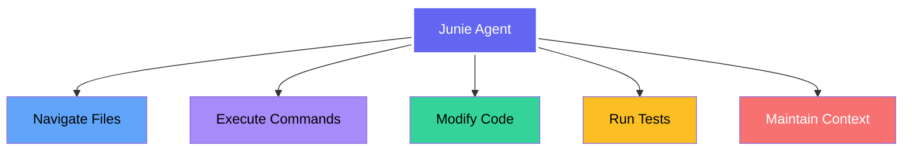
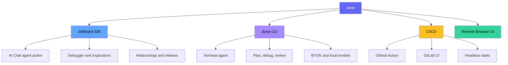
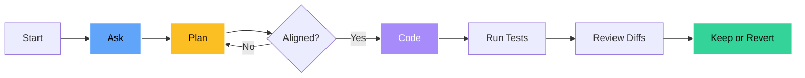
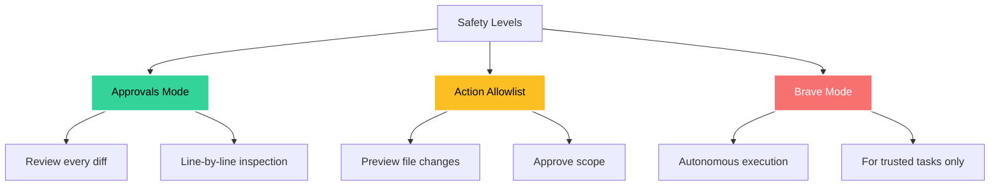
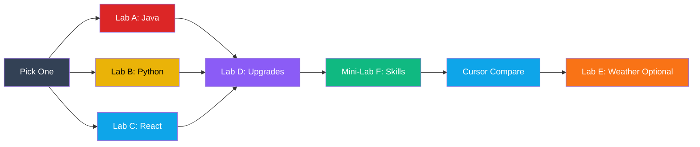
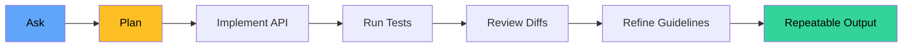
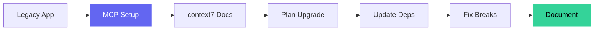
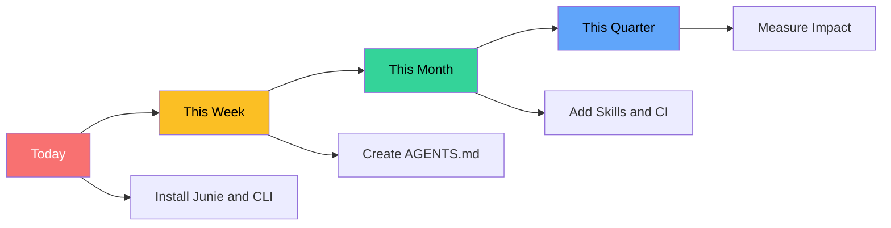

# AI Coding with Junie
## <span style="color: #fbbf24; font-size: 1.3em;">JetBrains' Coding Agent for IDE, CLI, and CI</span>

<div style="color: #e0f2fe; font-size: 1.1em; margin-top: 1.5em;">
Plan, implement, review, and verify<br/>
with a coding agent that understands your project
</div>

---
layout: default
background: 'linear-gradient(to bottom right, #1e293b, #334155)'
---

## <span style="color: #60a5fa;">🎯 What You'll Master Today</span>

<div style="display: grid; grid-template-columns: 1fr 1fr; gap: 1.5rem; font-size: 1.1em;">

<div style="background: rgba(96,165,250,0.15); padding: 1em; border-radius: 8px; border-left: 4px solid #60a5fa;">

### <span style="color: #60a5fa;">Core Concepts</span>
<div style="color: #dbeafe;">
• 🔍 <strong>Ask Mode</strong>: Read-only exploration<br/>
• 🧭 <strong>Plan Mode</strong>: Align before coding<br/>
• ⚡ <strong>Code Mode</strong>: Implement and verify<br/>
• 🛡️ <strong>Safety</strong>: Approvals, allowlists, review
</div>

</div>

<div style="background: rgba(168,85,247,0.15); padding: 1em; border-radius: 8px; border-left: 4px solid #a78bfa;">

### <span style="color: #a78bfa;">Hands-On Labs</span>
<div style="color: #e9d5ff;">
• ☕ <strong>Java</strong>: Spring Boot APIs<br/>
• 🐍 <strong>Python</strong>: Refactoring & testing<br/>
• ⚛️ <strong>React</strong>: Forms & validation<br/>
• 🔧 <strong>MCP</strong>: Current docs and tools
</div>

</div>

</div>

---
background: 'linear-gradient(135deg, #065f46, #047857)'
---

## <span style="color: #86efac;">📚 Prerequisites Check</span>

<div style="font-size: 1.1em; line-height: 2; color: #d1fae5;">

✅ **JetBrains IDE** (IntelliJ IDEA, PyCharm, WebStorm, GoLand, PhpStorm, RustRover, RubyMine)

✅ **JetBrains AI** subscription, Junie API key, or BYOK provider key

✅ **Development Environment** (Java 21+ / Python 3.8+ / Node 18+)

<div style="margin-top: 1em; padding: 1em; background: rgba(52,211,153,0.15); border-radius: 8px; border: 2px solid #10b981;">
<span style="color: #86efac;">Cost control:</span> <span style="color: #a7f3d0;">Use `/usage`, choose models intentionally, and prefer BYOK/local models for heavy practice</span>
</div>

<div style="margin-top: 0.5em; padding: 1em; background: rgba(251,191,36,0.15); border-radius: 8px; border: 2px solid #fbbf24;">
<span style="color: #fbbf24;">💡 Quick Setup:</span> <span style="color: #fef3c7;">We'll verify Junie, CLI, and lab runtimes together at the start</span>
</div>

</div>

---
background: 'linear-gradient(135deg, #1e40af, #1e3a8a)'
---

## <span style="color: #fbbf24;">🚀 Getting Started — Two Surfaces</span>

<div style="display: grid; grid-template-columns: 1fr 1fr; gap: 2rem; margin-top: 1em;">

<div style="background: rgba(96,165,250,0.15); padding: 1em; border-radius: 8px; border: 2px solid #60a5fa;">

### <span style="color: #60a5fa;">JetBrains IDE</span>
<span style="color: #dbeafe;">
1. AI Chat → Agent dropdown → **Junie**<br/>
2. Separate Junie tool window remains available<br/>
3. Best for indexes, refactorings, debugger, inspections
</span>

</div>

<div style="background: rgba(168,85,247,0.15); padding: 1em; border-radius: 8px; border: 2px solid #a78bfa;">

### <span style="color: #a78bfa;">Junie CLI</span>
<span style="color: #e9d5ff;">
1. `brew tap jetbrains-junie/junie && brew install junie`<br/>
2. Or: `curl -fsSL https://junie.jetbrains.com/install.sh | bash`<br/>
3. Run `junie` in any project, or `junie "task"` headlessly
</span>

</div>

</div>

<div style="margin-top: 1.5em; font-size: 1.1em;">

**Model and provider options:**
<div style="display: flex; flex-wrap: wrap; gap: 0.5rem; margin-top: 0.5em;">
<span style="background: rgba(251,191,36,0.2); padding: 0.4em 0.8em; border-radius: 5px; color: #fef3c7;">JetBrains account / credits</span>
<span style="background: rgba(167,139,250,0.2); padding: 0.4em 0.8em; border-radius: 5px; color: #e9d5ff;">OpenAI / Anthropic / Google / xAI</span>
<span style="background: rgba(52,211,153,0.2); padding: 0.4em 0.8em; border-radius: 5px; color: #d1fae5;">OpenRouter / Copilot</span>
<span style="background: rgba(248,113,113,0.2); padding: 0.4em 0.8em; border-radius: 5px; color: #fecaca;">Ollama / LM Studio / LiteLLM</span>
<span style="background: rgba(148,163,184,0.2); padding: 0.4em 0.8em; border-radius: 5px; color: #cbd5e1; font-size: 0.85em;">Use `/model` and `/usage` to stay intentional</span>
</div>

</div>

---
background: 'linear-gradient(135deg, #7c3aed, #6d28d9)'
---

## <span style="color: #fbbf24;">🤖 What is Junie?</span>

<div style="text-align: center; margin: 1em 0; color: #e9d5ff;">

**A coding agent that works where JetBrains developers already work**

</div>


```mermaid
graph TD
    A[Junie Agent] --> B[Navigate Files]
    A --> C[Execute Commands]
    A --> D[Modify Code]
    A --> E[Run Tests]
    A --> F[Maintain Context]
    
    style A fill:#6366f1,stroke:#fff,stroke-width:3px,color:#fff
    style B fill:#60a5fa,color:#000
    style C fill:#a78bfa,color:#000
    style D fill:#34d399,color:#000
    style E fill:#fbbf24,color:#000
    style F fill:#f87171,color:#fff
```

---
background: 'linear-gradient(135deg, #b91c1c, #7f1d1d)'
---

## <span style="color: #fbbf24;">🆕 Junie After Beta</span>

<div style="display: grid; grid-template-columns: 1fr 1fr; gap: 1.5rem; font-size: 1em;">

<div style="background: rgba(96,165,250,0.15); padding: 1em; border-radius: 8px; border-left: 4px solid #60a5fa;">

### <span style="color: #60a5fa;">General Availability Story</span>
<div style="color: #dbeafe;">
• JetBrains now calls Junie a coding agent<br/>
• IDE, terminal, and CI/CD are one product story<br/>
• Plans before it codes<br/>
• Runs long tasks while you review intent
</div>

</div>

<div style="background: rgba(168,85,247,0.15); padding: 1em; border-radius: 8px; border-left: 4px solid #a78bfa;">

### <span style="color: #a78bfa;">Plan Mode Is Central</span>
<div style="color: #e9d5ff;">
• Read-only exploration first<br/>
• Requirements, design, tests, delivery steps<br/>
• Review and refine before implementation<br/>
• Save plans as durable task docs
</div>

</div>

</div>

---
background: 'linear-gradient(135deg, #b91c1c, #7f1d1d)'
---

## <span style="color: #fbbf24;">🆕 Junie After Beta (continued)</span>

<div style="display: grid; grid-template-columns: 1fr 1fr; gap: 1.5rem; font-size: 1em;">

<div style="background: rgba(52,211,153,0.15); padding: 1em; border-radius: 8px; border-left: 4px solid #34d399;">

### <span style="color: #86efac;">Shared Agent Context</span>
<div style="color: #a7f3d0;">
• `.junie/AGENTS.md` first<br/>
• Root `AGENTS.md` also supported<br/>
• Skills live in `.junie/skills/`<br/>
• Extensions bundle skills, MCP, commands, agents
</div>

</div>

<div style="background: rgba(251,191,36,0.15); padding: 1em; border-radius: 8px; border-left: 4px solid #fbbf24;">

### <span style="color: #fde047;">Beyond the IDE</span>
<div style="color: #fef3c7;">
• `/review` for local diffs<br/>
• `/debug` with JetBrains debugger context<br/>
• `/remote` to continue a CLI session in browser<br/>
• GitHub Action and GitLab CI workflows
</div>

</div>

</div>

---
background: 'linear-gradient(135deg, #1e3a5f, #0f172a)'
---

## <span style="color: #fbbf24;">🗺️ Junie Surfaces</span>


```mermaid
graph TD
    A[Junie] --> B[JetBrains IDE]
    A --> C[Junie CLI]
    A --> D[CI/CD]
    A --> E[Remote Browser UI]

    B --> B1[AI Chat agent picker]
    B --> B2[Debugger and inspections]
    B --> B3[Refactorings and indexes]

    C --> C1[Terminal agent]
    C --> C2[Plan, debug, review]
    C --> C3[BYOK and local models]

    D --> D1[GitHub Action]
    D --> D2[GitLab CI]
    D --> D3[Headless tasks]

    style A fill:#6366f1,stroke:#fff,stroke-width:3px,color:#fff
    style B fill:#60a5fa,color:#000
    style C fill:#a78bfa,color:#000
    style D fill:#fbbf24,color:#000
    style E fill:#34d399,color:#000
```

<div style="text-align: center; margin-top: 1em; color: #94a3b8; font-size: 0.9em;">
The CLI can connect to a matching JetBrains IDE for symbol-aware search, inspections, test discovery, and debugger-backed workflows.
</div>

---
background: 'linear-gradient(135deg, #1e3a5f, #0f172a)'
---

## <span style="color: #fbbf24;">🔄 Three Working Modes</span>

<div style="display: grid; grid-template-columns: 1fr 1fr 1fr; gap: 1.2rem; margin-top: 1.5em;">

<div style="background: linear-gradient(135deg, rgba(96,165,250,0.15), rgba(96,165,250,0.1)); padding: 1em; border-radius: 8px; border: 2px solid #60a5fa;">

### <span style="color: #60a5fa;">🔍 Ask Mode</span>

<div style="color: #dbeafe;">
<strong>Read-Only Analysis</strong>

• Explain complex code<br/>
• Analyze architecture<br/>
• Find bugs & issues<br/>
• Review security<br/>
• Check test coverage

<div style="margin-top: 1em; color: #93c5fd; font-size: 0.9em;">
Perfect for understanding before changing
</div>
</div>

</div>

<div style="background: linear-gradient(135deg, rgba(251,191,36,0.15), rgba(251,191,36,0.1)); padding: 1em; border-radius: 8px; border: 2px solid #fbbf24;">

### <span style="color: #fde047;">🧭 Plan Mode</span>

<div style="color: #fef3c7;">
<strong>Design Before Edits</strong>

• Requirements<br/>
• Technical design<br/>
• Testing strategy<br/>
• Delivery steps<br/>
• Confirm or refine

<div style="margin-top: 1em; color: #fde68a; font-size: 0.9em;">
Best for non-trivial tasks
</div>
</div>

</div>

<div style="background: linear-gradient(135deg, rgba(168,85,247,0.15), rgba(168,85,247,0.1)); padding: 1em; border-radius: 8px; border: 2px solid #a78bfa;">

### <span style="color: #a78bfa;">⚡ Code Mode</span>

<div style="color: #e9d5ff;">
<strong>Make Changes</strong>

• Implement features<br/>
• Fix bugs<br/>
• Refactor code<br/>
• Generate tests<br/>
• Update dependencies

<div style="margin-top: 1em; color: #c4b5fd; font-size: 0.9em;">
Executes multi-step plans with diffs
</div>
</div>

</div>

</div>

---
background: 'linear-gradient(135deg, #065f46, #047857)'
---

## <span style="color: #fbbf24;">💡 Professional Workflow</span>


```mermaid
graph LR
    A[Start] --> B[Ask]
    B --> C[Plan]
    C --> D{Aligned?}
    D -->|No| C
    D -->|Yes| E[Code]
    E --> F[Run Tests]
    F --> G[Review Diffs]
    G --> H[Keep or Revert]
    
    style B fill:#60a5fa,stroke:#fff,stroke-width:2px,color:#000
    style C fill:#fbbf24,stroke:#fff,stroke-width:2px,color:#000
    style E fill:#a78bfa,stroke:#fff,stroke-width:2px,color:#fff
    style H fill:#34d399,stroke:#fff,stroke-width:2px,color:#000
```

<div style="text-align: center; margin-top: 1.6em; font-size: 1.2em; color: #86efac;">
Use Plan mode when the cost of the wrong implementation is higher than the cost of five minutes of alignment.
</div>

---
background: 'linear-gradient(135deg, #0f172a, #1e3a5f)'
---

## <span style="color: #fbbf24;">🧭 Plan Mode in Practice</span>

<div style="display: grid; grid-template-columns: 1fr 1fr; gap: 1.5rem; color: #e0f2fe;">

<div style="background: rgba(96,165,250,0.15); padding: 1em; border-radius: 8px; border-left: 4px solid #60a5fa;">

### <span style="color: #93c5fd;">Start It</span>
• Press `Shift+Tab` in Junie CLI<br/>
• Or type `/plan <task>`<br/>
• In the IDE, start with Ask/Auto and request a plan first<br/>
• For installed flags, check `junie --help`

</div>

<div style="background: rgba(251,191,36,0.15); padding: 1em; border-radius: 8px; border-left: 4px solid #fbbf24;">

### <span style="color: #fde047;">Review It</span>
• Read assumptions<br/>
• Edit scope before code exists<br/>
• Check testing strategy<br/>
• Confirm implementation only after the plan matches your intent

</div>

</div>

<div style="margin-top: 1.2em; padding: 1em; background: rgba(52,211,153,0.15); border-radius: 8px; border: 1px solid #10b981; color: #a7f3d0;">
Teaching move: use one complete prompt, let Junie plan, then ask attendees what they would change before implementation.
</div>

---
background: 'linear-gradient(135deg, #1e40af, #1e3a8a)'
---

## <span style="color: #fbbf24;">📝 Project Guidelines</span>

<div style="font-size: 1.05em; color: #e0f2fe;">

**Preferred:** `.junie/AGENTS.md` &nbsp;|&nbsp; **Also supported:** root `AGENTS.md` &nbsp;|&nbsp; **Legacy:** `.junie/guidelines.md`

```markdown
## Technology Stack
- Framework: Spring Boot 3.2
- Testing: JUnit 5 + AssertJ

## Conventions
- REST: /api/v1/{resource}
- DTOs: Java records
- Tests: Given-When-Then
```

<div style="font-size: 0.85em; margin-top: 0.5em; color: #94a3b8;">
Lookup order: `.junie/AGENTS.md` → `AGENTS.md` (project root) → `.junie/guidelines.md` (legacy). Global guidelines can live in `~/.junie/AGENTS.md`.
</div>

<div style="display: grid; grid-template-columns: 1fr 1fr; gap: 1rem; margin-top: 1em;">

<div style="background: rgba(239,68,68,0.15); padding: 0.8em; border-radius: 8px; border: 1px solid #ef4444;">
<strong style="color: #fca5a5;">❌ Without Guidelines</strong><br/>
<span style="color: #fecaca;">
Inconsistent patterns<br/>
Multiple review cycles<br/>
Style conflicts
</span>
</div>

<div style="background: rgba(52,211,153,0.15); padding: 0.8em; border-radius: 8px; border: 1px solid #10b981;">
<strong style="color: #86efac;">✅ With Guidelines</strong><br/>
<span style="color: #a7f3d0;">
Consistent output<br/>
Fewer review cycles<br/>
Team alignment
</span>
</div>

</div>

</div>

---
background: 'linear-gradient(135deg, #dc2626, #991b1b)'
---

## <span style="color: #fbbf24;">🛡️ Safety Controls</span>


```mermaid
graph TD
    A[Safety Levels] --> B[Approvals Mode]
    A --> C[Action Allowlist]
    A --> D[Brave Mode]
    
    B --> B1[Review every diff]
    B --> B2[Line-by-line inspection]
    
    C --> C1[Preview file changes]
    C --> C2[Approve scope]
    
    D --> D1[Autonomous execution]
    D --> D2[For trusted tasks only]
    
    style B fill:#34d399,stroke:#fff,stroke-width:2px,color:#000
    style C fill:#fbbf24,stroke:#fff,stroke-width:2px,color:#000
    style D fill:#f87171,stroke:#fff,stroke-width:2px,color:#fff
```

---
background: 'linear-gradient(135deg, #065f46, #047857)'
---

## <span style="color: #fbbf24;">⚡ When to Use Each Mode</span>

<style>
.mode-table { width: 100%; border-collapse: collapse; margin-top: 1em; }
.mode-table th, .mode-table td { padding: 0.8em; text-align: left; border: 1px solid rgba(251,191,36,0.3); color: #e0f2fe; }
.mode-table th { background: rgba(251,191,36,0.2); color: #fbbf24; }
.good { color: #86efac; }
.caution { color: #fbbf24; }
.danger { color: #f87171; }
</style>

<table class="mode-table">
<thead>
<tr>
<th>Mode</th>
<th>Good For</th>
<th>Not For</th>
</tr>
</thead>
<tbody>
<tr>
<td><strong class="good">Approvals</strong></td>
<td>• Critical business logic<br/>• First-time tasks<br/>• Learning Junie</td>
<td>• Repetitive formatting<br/>• Simple refactors</td>
</tr>
<tr>
<td><strong class="caution">Allowlist</strong></td>
<td>• Known file sets<br/>• Defined scope<br/>• Team reviews</td>
<td>• Exploratory changes<br/>• Unknown impact</td>
</tr>
<tr>
<td><strong class="danger">Brave</strong></td>
<td>• Test generation<br/>• Formatting<br/>• Documentation</td>
<td>• Production code<br/>• Database changes<br/>• First attempts</td>
</tr>
</tbody>
</table>

---
background: 'linear-gradient(135deg, #7c3aed, #6d28d9)'
---

## <span style="color: #fbbf24;">🔌 MCP: Model Context Protocol</span>

<div style="display: grid; grid-template-columns: 1fr 1fr; gap: 1.3rem; margin-top: 0.6em;">

<div style="background: rgba(96,165,250,0.15); padding: 0.85em; border-radius: 8px; border: 1px solid #3b82f6;">

### <span style="color: #93c5fd;">Use MCP For</span>
<span style="color: #dbeafe;">
• External services<br/>
• Current docs<br/>
• Browser exploration<br/>
• Shared project tools
</span>

</div>

<div style="background: rgba(52,211,153,0.15); padding: 0.85em; border-radius: 8px; border: 1px solid #10b981;">

### <span style="color: #86efac;">Use Skills For</span>
<span style="color: #d1fae5;">
• Repeatable workflows<br/>
• Test conventions<br/>
• Review checklists<br/>
• Team patterns
</span>

</div>

</div>

<div style="display: grid; grid-template-columns: 1.2fr 1fr; gap: 1.3rem; margin-top: 1em;">

<div>

```json
{
  "mcpServers": {
    "context7": {
      "command": "npx",
      "args": ["-y", "@upstash/context7-mcp"]
    },
    "playwright": {
      "command": "npx",
      "args": ["-y", "@playwright/mcp"]
    }
  }
}
```

</div>

<div style="color: #e9d5ff; font-size: 0.95em; line-height: 1.8;">
<strong style="color: #fbbf24;">Where it lives</strong><br/>
CLI: `/mcp`<br/>
Project: `.junie/mcp/mcp.json`<br/>
User: `~/.junie/mcp/mcp.json`

<div style="margin-top: 0.8em; color: #fef3c7;">
context7 is the main workshop MCP example.
</div>

</div>

</div>

---
background: 'linear-gradient(135deg, #1e40af, #1e3a8a)'
---

## <span style="color: #fbbf24;">🧪 Lab Overview</span>


```mermaid
graph LR
    P[Pick One] --> A[Lab A: Java]
    P --> B[Lab B: Python]
    P --> C[Lab C: React]
    A --> D[Lab D: Upgrades]
    B --> D
    C --> D
    D --> E[Mini-Lab F: Skills]
    E --> F[Cursor Compare]
    F --> G[Lab E: Weather Optional]

    style P fill:#334155,color:#fff
    style A fill:#dc2626,color:#fff
    style B fill:#eab308,color:#000
    style C fill:#0ea5e9,color:#fff
    style D fill:#8b5cf6,color:#fff
    style E fill:#10b981,color:#fff
    style F fill:#0ea5e9,color:#fff
    style G fill:#f97316,color:#fff
```

---
background: 'linear-gradient(135deg, #1e40af, #1e3a8a)'
---

## <span style="color: #fbbf24;">🧪 Lab Overview — Tracks</span>

<div style="display: grid; grid-template-columns: repeat(3, 1fr); gap: 0.8rem; margin-top: 1.2em;">

<div style="background: rgba(220,38,38,0.15); padding: 1em; border-radius: 8px; text-align: center; border: 1px solid #dc2626;">
<strong style="color: #fca5a5;">☕ Java</strong><br/>
<span style="color: #fecaca;">
Spring Boot<br/>
REST APIs<br/>
JUnit + AssertJ
</span>
</div>

<div style="background: rgba(234,179,8,0.15); padding: 1em; border-radius: 8px; text-align: center; border: 1px solid #eab308;">
<strong style="color: #fde047;">🐍 Python</strong><br/>
<span style="color: #fef3c7;">
PEP 8<br/>
Type hints<br/>
pytest
</span>
</div>

<div style="background: rgba(14,165,233,0.15); padding: 1em; border-radius: 8px; text-align: center; border: 1px solid #0ea5e9;">
<strong style="color: #7dd3fc;">⚛️ React</strong><br/>
<span style="color: #bae6fd;">
TypeScript<br/>
Forms<br/>
Testing Library
</span>
</div>

<div style="background: rgba(139,92,246,0.15); padding: 1em; border-radius: 8px; text-align: center; border: 1px solid #8b5cf6;">
<strong style="color: #c4b5fd;">🔧 MCP</strong><br/>
<span style="color: #e9d5ff;">
context7<br/>
Upgrades<br/>
Migration
</span>
</div>

<div style="background: rgba(16,185,129,0.15); padding: 1em; border-radius: 8px; text-align: center; border: 1px solid #10b981;">
<strong style="color: #86efac;">🧩 Skills</strong><br/>
<span style="color: #d1fae5;">
Reusable<br/>
Workflow<br/>
Playwright
</span>
</div>

<div style="background: rgba(249,115,22,0.15); padding: 1em; border-radius: 8px; text-align: center; border: 1px solid #f97316;">
<strong style="color: #fed7aa;">🌦️ Lab E</strong><br/>
<span style="color: #ffedd5;">
Weather API<br/>
Proxy<br/>
Optional
</span>
</div>

</div>

---
background: 'linear-gradient(135deg, #dc2626, #991b1b)'
---

## <span style="color: #fbbf24;">☕ Lab A: Spring Boot Journey</span>


```mermaid
graph LR
    A[Ask] --> B[Plan]
    B --> C[Implement API]
    C --> D[Run Tests]
    D --> E[Review Diffs]
    E --> F[Refine Guidelines]
    F --> G[Repeatable Output]
    
    style A fill:#60a5fa,color:#000
    style B fill:#fbbf24,color:#000
    style G fill:#34d399,color:#000
```

<div style="display: grid; grid-template-columns: 1fr 1fr; gap: 1rem; margin-top: 1em;">

<div style="background: rgba(239,68,68,0.15); padding: 0.8em; border-radius: 8px; border: 1px solid #dc2626;">
<strong style="color: #fca5a5;">Baseline Pass</strong><br/>
<span style="color: #fecaca; font-size: 0.9em;">
• Ask Junie to inspect first<br/>
• Let it propose a plan<br/>
• Watch where style drifts
</span>
</div>

<div style="background: rgba(52,211,153,0.15); padding: 0.8em; border-radius: 8px; border: 1px solid #10b981;">
<strong style="color: #86efac;">Guided Pass</strong><br/>
<span style="color: #a7f3d0; font-size: 0.9em;">
• `.junie/AGENTS.md` loaded<br/>
• One complete feature prompt<br/>
• Tests and review included
</span>
</div>

</div>

---
background: 'linear-gradient(135deg, #eab308, #a16207)'
---

## <span style="color: #fef3c7;">🐍 Lab B: Python Transformation</span>

<div style="display: grid; grid-template-columns: 1fr 1fr; gap: 2rem;">

<div style="background: rgba(220,38,38,0.15); padding: 1em; border-radius: 8px; border: 1px solid #dc2626;">

### <span style="color: #fca5a5;">Starting Point</span>
```python
def calc(x,y,op):
    if op=="add": return x+y
    elif op=="sub": return x-y
```
<span style="color: #fecaca;">
• No type hints<br/>
• Poor naming<br/>
• No tests<br/>
• No docs
</span>

</div>

<div style="background: rgba(52,211,153,0.15); padding: 1em; border-radius: 8px; border: 1px solid #10b981;">

### <span style="color: #86efac;">Target Outcome</span>
```python
def calculate(
    left: float,
    right: float,
    operation: Operation,
) -> float:
    """Apply a supported operation."""
```
<span style="color: #a7f3d0;">
• Type-safe API<br/>
• pytest coverage<br/>
• Documented edge cases
</span>

</div>

</div>

---
background: 'linear-gradient(135deg, #0ea5e9, #0369a1)'
---

## <span style="color: #fbbf24;">⚛️ Lab C: React Forms</span>

<div style="color: #e0f2fe;">

```typescript
interface RegistrationForm {
  email: string;      // valid email
  password: string;   // min 8, special char
  confirm: string;    // must match
  terms: boolean;     // required
}
```

</div>

<div style="display: grid; grid-template-columns: repeat(4, 1fr); gap: 1rem; margin-top: 2em;">

<div style="background: rgba(96,165,250,0.2); padding: 0.8em; border-radius: 8px; text-align: center; border: 1px solid #3b82f6;">
<strong style="color: #93c5fd;">React Hook Form</strong><br/>
<span style="color: #dbeafe;">Form state</span>
</div>

<div style="background: rgba(168,85,247,0.2); padding: 0.8em; border-radius: 8px; text-align: center; border: 1px solid #8b5cf6;">
<strong style="color: #c4b5fd;">Zod</strong><br/>
<span style="color: #e9d5ff;">Validation</span>
</div>

<div style="background: rgba(52,211,153,0.2); padding: 0.8em; border-radius: 8px; text-align: center; border: 1px solid #10b981;">
<strong style="color: #86efac;">Testing Library</strong><br/>
<span style="color: #a7f3d0;">90% coverage</span>
</div>

<div style="background: rgba(251,191,36,0.2); padding: 0.8em; border-radius: 8px; text-align: center; border: 1px solid #f59e0b;">
<strong style="color: #fde047;">Accessibility</strong><br/>
<span style="color: #fef3c7;">ARIA compliant</span>
</div>

</div>

<div style="margin-top: 1.5em; padding: 0.8em; background: rgba(251,191,36,0.15); border-radius: 8px; border: 1px solid #f59e0b;">
<span style="color: #fde047;">Teaching move:</span> <span style="color: #fef3c7;">Use one complete prompt that asks for the component, validation, accessible errors, tests, and a final self-review.</span>
</div>

---
background: 'linear-gradient(135deg, #8b5cf6, #6d28d9)'
---

## <span style="color: #fbbf24;">🔧 Lab D: Smart Upgrades with context7</span>


```mermaid
graph LR
    A[Legacy App] --> B[MCP Setup]
    B --> C[context7 Docs]
    C --> D[Plan Upgrade]
    D --> E[Update Deps]
    E --> F[Fix Breaks]
    F --> G[Document]
    
    style B fill:#6366f1,stroke:#fff,stroke-width:2px,color:#fff
    style G fill:#34d399,stroke:#fff,stroke-width:2px,color:#000
```

<div style="display: flex; justify-content: center; gap: 2rem; margin-top: 1.5em;">

<div style="text-align: center;">
<span style="color: #fca5a5; font-size: 1.5em;">React 17</span><br/>
<span style="color: #fecaca;">Legacy</span>
</div>

<div style="font-size: 2em; color: #fbbf24;">→</div>

<div style="text-align: center;">
<span style="color: #86efac; font-size: 1.5em;">React 18</span><br/>
<span style="color: #a7f3d0;">Modern</span>
</div>

</div>

<div style="margin-top: 1.5em; padding: 0.8em; background: rgba(251,191,36,0.15); border-radius: 8px; border: 1px solid #fbbf24;">
<span style="color: #fde047;">Four-hour version:</span> <span style="color: #fef3c7;">emphasize MCP setup, migration plan quality, and one contained implementation slice.</span>
</div>

---
background: 'linear-gradient(135deg, #10b981, #047857)'
---

## <span style="color: #fbbf24;">🧩 Mini-Lab: Create a Playwright Skill</span>

<div style="text-align: center; font-size: 1.2em; margin: 1em 0; color: #d1fae5;">

**Capture the workflow once, reuse it every time**

</div>

```markdown
Create a skill named playwright-e2e that captures our
browser testing conventions:
- Prefer accessible locators
- Use page objects only after duplication appears
- Run npx playwright test
- Summarize failures and screenshots
```

<div style="display: grid; grid-template-columns: repeat(4, 1fr); gap: 1rem; margin-top: 2em;">

<div style="background: rgba(251,191,36,0.2); padding: 0.5em; border-radius: 5px; text-align: center; border: 1px solid #f59e0b;">
<span style="color: #fef3c7;">1. Inspect Existing Skills</span>
</div>

<div style="background: rgba(96,165,250,0.2); padding: 0.5em; border-radius: 5px; text-align: center; border: 1px solid #3b82f6;">
<span style="color: #dbeafe;">2. Ask Junie to Create One</span>
</div>

<div style="background: rgba(168,85,247,0.2); padding: 0.5em; border-radius: 5px; text-align: center; border: 1px solid #8b5cf6;">
<span style="color: #e9d5ff;">3. Use It on a Test</span>
</div>

<div style="background: rgba(52,211,153,0.2); padding: 0.5em; border-radius: 5px; text-align: center; border: 1px solid #10b981;">
<span style="color: #a7f3d0;">4. Run Local CLI</span>
</div>

</div>

<div style="margin-top: 1em; padding: 0.8em; background: rgba(251,191,36,0.15); border-radius: 8px; border: 1px solid #fbbf24;">
<span style="color: #fde047;">Teaching point:</span> <span style="color: #fef3c7;">Playwright MCP is good for interactive browser exploration. A Skill is better for repeatable team testing conventions.</span>
</div>

---
background: 'linear-gradient(135deg, #065f46, #047857)'
---

## <span style="color: #fbbf24;">🎯 Common Patterns</span>

<div style="display: grid; grid-template-columns: 1fr 1fr 1fr; gap: 1.5rem;">

<div style="background: rgba(96,165,250,0.15); padding: 1em; border-radius: 8px; border: 1px solid #3b82f6;">

### <span style="color: #93c5fd;">TDD Flow</span>
<span style="color: #dbeafe;">
1. Ask: "What should fail?"<br/>
2. Plan: "How will we prove it?"<br/>
3. Code: "Implement and run tests"
</span>

<div style="color: #60a5fa; margin-top: 0.5em;">
Red → Green → Refactor
</div>

</div>

<div style="background: rgba(168,85,247,0.15); padding: 1em; border-radius: 8px; border: 1px solid #8b5cf6;">

### <span style="color: #c4b5fd;">Plan-First Feature</span>
<span style="color: #e9d5ff;">
1. State acceptance criteria<br/>
2. Review Junie's plan<br/>
3. Approve a focused diff
</span>

<div style="color: #a78bfa; margin-top: 0.5em;">
Scope stays visible
</div>

</div>

<div style="background: rgba(52,211,153,0.15); padding: 1em; border-radius: 8px; border: 1px solid #10b981;">

### <span style="color: #86efac;">Upgrades</span>
<span style="color: #a7f3d0;">
1. Use current docs<br/>
2. Plan migration<br/>
3. Verify behavior
</span>

<div style="color: #34d399; margin-top: 0.5em;">
Systematic migration
</div>

</div>

</div>

---
background: 'linear-gradient(135deg, #dc2626, #991b1b)'
---

## <span style="color: #fbbf24;">🚀 CI/CD Integration — Junie GitHub Action</span>

```yaml
name: Junie Agent
on:
  issue_comment:
    types: [created]
  pull_request_review_comment:
    types: [created]

permissions: { contents: write, pull-requests: write, issues: write }

jobs:
  junie:
    if: contains(github.event.comment.body, '@junie-agent')
    runs-on: ubuntu-latest
    steps:
      - uses: actions/checkout@v4
      - uses: JetBrains/junie-github-action@v1
        with:
          junie_api_key: ${{ secrets.JUNIE_API_KEY }}
```

<div style="margin-top: 1em; color: #fecaca; font-size: 1em; line-height: 1.7;">
GitHub: `@junie-agent` in issues or PRs<br/>
GitLab: `#junie` in merge request comments<br/>
CLI: `junie "prompt"` for headless local automation
</div>

---
background: 'linear-gradient(135deg, #065f46, #047857)'
---

## <span style="color: #fbbf24;">📱 Remote Mode Demo</span>

<div style="display: grid; grid-template-columns: 1fr 1fr; gap: 1.4rem; margin-top: 1em;">

<div style="background: rgba(96,165,250,0.15); padding: 1em; border-radius: 8px; border: 1px solid #3b82f6;">

### <span style="color: #93c5fd;">What It Is</span>
<span style="color: #dbeafe;">
• Browser UI for the same CLI session<br/>
• Works from laptop, tablet, or phone browser<br/>
• Terminal and web UI stay synchronized<br/>
• Your machine must stay awake
</span>

</div>

<div style="background: rgba(251,191,36,0.15); padding: 1em; border-radius: 8px; border: 1px solid #f59e0b;">

### <span style="color: #fde047;">Demo Flow</span>
<span style="color: #fef3c7;">
1. Start `junie` in the terminal<br/>
2. Run `/remote`<br/>
3. Open `junie.jetbrains.com/remote`<br/>
4. Respond from the browser<br/>
5. Run `/remote` and choose Stop Remote Session
</span>

</div>

</div>

<div style="margin-top: 1em; color: #d1fae5; font-size: 0.95em;">
Remote mode uses the Junie service. JetBrains Account sign-in is the simplest path; a Junie API key is the alternate route.
</div>

---
background: 'linear-gradient(135deg, #0f172a, #1e3a5f)'
---

## <span style="color: #fbbf24;">🤔 Why Junie Instead of Cursor?</span>

<div style="display: grid; grid-template-columns: 1fr 1fr 1fr; gap: 1rem; margin-top: 1em;">

<div style="background: rgba(96,165,250,0.15); padding: 1em; border-radius: 8px; border-left: 4px solid #60a5fa;">

### <span style="color: #60a5fa;">Use Junie When...</span>
<div style="color: #dbeafe;">
• Team lives in JetBrains IDEs<br/>
• IDE refactorings matter<br/>
• Plans before edits matter<br/>
• IDE, CLI, and CI should align
</div>

</div>

<div style="background: rgba(168,85,247,0.15); padding: 1em; border-radius: 8px; border-left: 4px solid #a78bfa;">

### <span style="color: #a78bfa;">Use Cursor When...</span>
<div style="color: #e9d5ff;">
• AI-first editor is desired<br/>
• Cursor Tab is central<br/>
• Background agents matter<br/>
• Team already uses rules/Bugbot
</div>

</div>

<div style="background: rgba(251,191,36,0.15); padding: 1em; border-radius: 8px; border-left: 4px solid #fbbf24;">

### <span style="color: #fde047;">Compare Live</span>
<div style="color: #fef3c7;">
• Same repo<br/>
• Same task<br/>
• Same acceptance criteria<br/>
• Stop before a second workshop
</div>

</div>

</div>

<div style="text-align: center; margin-top: 1em; color: #94a3b8; font-size: 0.9em;">
Cursor can also run inside JetBrains through ACP, so this is about workflow fit.
</div>

---
background: 'linear-gradient(135deg, #065f46, #047857)'
---

## <span style="color: #fbbf24;">✨ Key Takeaways</span>

<div style="font-size: 1.3em; line-height: 2; margin-top: 1em; color: #d1fae5;">

✅ **Ask before Code** - Understand first, implement second

✅ **Plan before big changes** - Align on requirements, tests, and scope

✅ **Guidelines drive consistency** - Encode your team's DNA

✅ **Skills preserve workflows** - Reuse task-specific patterns

✅ **Build trust gradually** - Approvals → Allowlist → Brave

✅ **CLI matters** - Use Junie outside the IDE and in automation

✅ **Safety first** - Review diffs, run tests, maintain control

</div>

---
background: 'linear-gradient(135deg, #1e40af, #1e3a8a)'
---

## <span style="color: #fbbf24;">🎯 Your Next Steps</span>


```mermaid
graph LR
    A[Today] --> B[This Week]
    B --> C[This Month]
    C --> D[This Quarter]

    A --> A1[Install Junie and CLI]
    B --> B1[Create AGENTS.md]
    C --> C1[Add Skills and CI]
    D --> D1[Measure Impact]

    style A fill:#f87171,color:#fff
    style B fill:#fbbf24,color:#000
    style C fill:#34d399,color:#000
    style D fill:#60a5fa,color:#000
```

<div style="text-align: center; margin-top: 2em; padding: 1em; background: rgba(251,191,36,0.15); border-radius: 10px; border: 2px solid #fbbf24;">
<span style="color: #fef3c7; font-size: 1.2em;">
🚀 Start with Ask and Plan → Approve focused diffs → Add guidelines → Automate later
</span>
</div>

---
background: 'linear-gradient(135deg, #dc2626, #991b1b)'
---

## <span style="color: #fbbf24;">💬 Discussion Time</span>

<div style="font-size: 1.3em; line-height: 2.5; margin-top: 1em; color: #fecaca;">

### Let's Explore Together:

🤔 **IDE plugin vs CLI vs CI/CD — which fits your workflow?**

🛡️ **Where do you always want human review?**

📋 **How could AGENTS.md guidelines help your team?**

🔧 **Which MCP tools and Agent Skills would you create?**

🚀 **Where does Cursor, Codex, Claude, or Antigravity fit better?**

</div>

---
background: 'linear-gradient(135deg, #065f46, #047857)'
---

## <span style="color: #fbbf24;">📚 Resources Hub</span>

<div style="display: grid; grid-template-columns: 1fr 1fr; gap: 2rem; color: #d1fae5;">

<div>

### Documentation
• 📖 [Junie Docs](https://junie.jetbrains.com/docs/)<br/>
• 📝 [Guidelines & Memory](https://junie.jetbrains.com/docs/guidelines-and-memory.html)<br/>
• 🔧 [Agent Skills](https://junie.jetbrains.com/docs/agent-skills.html)<br/>
• 🖥️ [CLI Reference](https://junie.jetbrains.com/docs/junie-cli.html)

### Agent Workflows
• 🐙 [GitHub Action](https://github.com/JetBrains/junie-github-action)<br/>
• 🦊 [GitLab CI](https://junie.jetbrains.com/docs/junie-gitlab-ci-cd.html)<br/>
• 🧭 [Plan Mode](https://junie.jetbrains.com/docs/junie-plan-mode.html)<br/>
• 📱 [Remote Mode](https://junie.jetbrains.com/docs/junie-cli-remote-mode.html)

</div>

<div>

### GitHub
• 🗂️ [Guidelines Catalog](https://github.com/JetBrains/junie-guidelines)<br/>
• 📚 [Context7 MCP](https://github.com/upstash/context7)<br/>
• 🧪 This repository

### Adjacent Tools
• 🖊️ Cursor Docs<br/>
• 🤖 Codex / Claude / Antigravity docs<br/>
• 🔌 Agent Communication Protocol

### Community
• 💬 JetBrains AI Slack<br/>
• 🏷️ Stack Overflow: `jetbrains-junie`<br/>
• 📧 Support team

</div>

</div>

---
background: 'linear-gradient(135deg, #7c3aed, #6d28d9)'
---

## <span style="color: #fbbf24;">🙏 Thank You!</span>

<div style="text-align: center; margin-top: 2em;">

<div style="font-size: 1.5em; color: #e9d5ff; margin-bottom: 1em;">
AI amplifies good practices
</div>

<div style="padding: 1.5em; background: rgba(251,191,36,0.15); border-radius: 12px; border: 3px solid #fbbf24; max-width: 600px; margin: 0 auto;">
<span style="color: #fef3c7; font-size: 1.3em;">
💡 Remember:<br/>
<strong>Good agents amplify clear intent,<br/>
tested code, and team conventions.</strong>
</span>
</div>

<div style="margin-top: 2em; font-size: 1.2em; color: #c4b5fd;">
Questions? Let's explore together! 🚀
</div>

</div>

---
background: 'linear-gradient(135deg, #7c3aed, #6d28d9)'
---

## <span style="color: #fbbf24;">About Ken Kousen</span>

<div style="text-align: center;">

### <span style="color: #fde047;">Ken Kousen</span>
<div style="color: #c4b5fd;">President, Kousen IT, Inc.</div>

<div style="display: grid; grid-template-columns: 1fr 1fr; gap: 2em; margin: 2em auto; max-width: 600px;">
<div style="text-align: left; color: #e0f2fe;">
📧 <a href="mailto:ken.kousen@kousenit.com" style="color: #60a5fa;">ken.kousen@kousenit.com</a><br/>
🐙 <a href="https://github.com/kousen" style="color: #60a5fa;">github.com/kousen</a><br/>
📺 <a href="https://youtube.com/@talesfromthejarside" style="color: #60a5fa;">@talesfromthejarside</a>
</div>
<div style="text-align: left; color: #e0f2fe;">
📝 <a href="https://kousenit.substack.com" style="color: #60a5fa;">kousenit.substack.com</a><br/>
💼 <a href="https://linkedin.com/in/kenkousen" style="color: #60a5fa;">linkedin.com/in/kenkousen</a><br/>
🦋 <a href="https://bsky.app/profile/kousenit.com" style="color: #60a5fa;">bsky.app/profile/kousenit.com</a>
</div>
</div>

<div style="margin-top: 2em; padding: 1em; background: rgba(251, 191, 36, 0.15); border-radius: 10px; border: 2px solid #fbbf24;">
<span style="color: #fef3c7;">
AI agents aren't here to replace developers—<br/>
they're here to make us <strong>better</strong> developers.
</span>
</div>

</div>

---
background: 'linear-gradient(135deg, #1e40af, #1e3a8a)'
---

## <span style="color: #fbbf24;">🎁 Bonus: Quick Reference</span>

<div style="display: grid; grid-template-columns: 1fr 1fr 1fr; gap: 1rem; font-size: 0.9em;">

<div style="background: rgba(96,165,250,0.15); padding: 1em; border-radius: 8px; border: 1px solid #3b82f6;">

### <span style="color: #93c5fd;">IDE Shortcuts</span>
<span style="color: #dbeafe;">
• `Ctrl+Alt+J` - Open Junie<br/>
• `Ctrl+Enter` - Execute<br/>
• `Esc` - Cancel operation
</span>
### <span style="color: #93c5fd;">CLI Shortcuts</span>
<span style="color: #dbeafe;">
• `Shift+Tab` - Plan mode<br/>
• `/mcp` - MCP setup<br/>
• `/model` - Choose model<br/>
• `/effort` - Reasoning effort/cost<br/>
• `/usage` - Credits usage<br/>
• `Ctrl+B` - Brave mode<br/>
• `Ctrl+R` - Prompt history
</span>

</div>

<div style="background: rgba(168,85,247,0.15); padding: 1em; border-radius: 8px; border: 1px solid #8b5cf6;">

### <span style="color: #c4b5fd;">Common Commands</span>
<span style="color: #e9d5ff;">
"Analyze this file"<br/>
"Create a plan first"<br/>
"Add tests with 90% coverage"<br/>
"Implement and run tests"<br/>
"Review the diff"
</span>

</div>

<div style="background: rgba(52,211,153,0.15); padding: 1em; border-radius: 8px; border: 1px solid #10b981;">

### <span style="color: #86efac;">MCP Tools</span>
```json
{
  "context7": "Library docs",
  "playwright": "E2E tests",
  "search": "Web search",
  "custom": "Your tools"
}
```

</div>

</div>

<div style="text-align: center; margin-top: 2em; color: #fbbf24;">
🎯 Print this slide for your desk!
</div>
